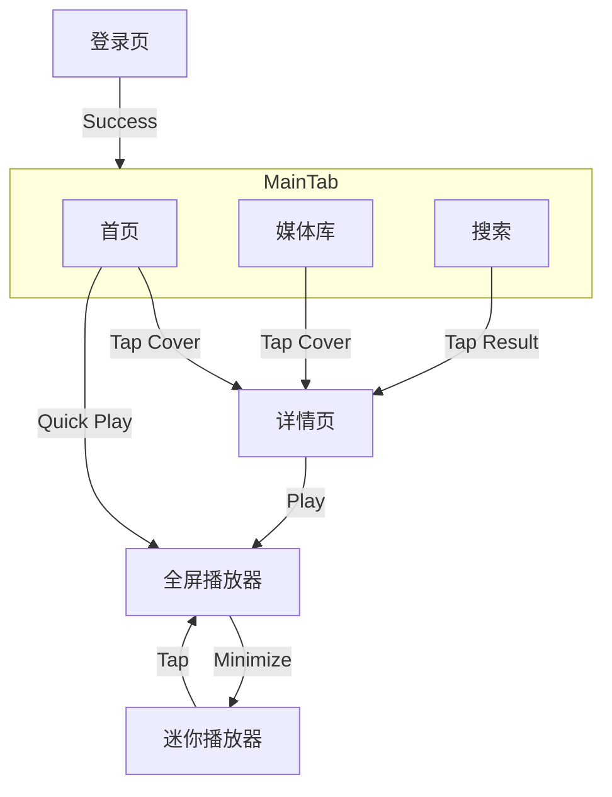

# Audiobookshelf iOS 客户端详细功能设计文档

## 1. 系统架构设计 (Architecture)

采用 **MVVM (Model-View-ViewModel)** 架构，结合 SwiftUI 声明式 UI 框架。

- **Model**: 定义数据结构 (基于 `Codable`)，直接映射 ABS API 响应。
- **ViewModel**: 处理业务逻辑、状态管理，使用 `@Observable` (iOS 17+) 进行数据绑定。
- **View**: SwiftUI 视图层，负责 UI 渲染和用户交互。
- **Services**: 网络层 (NetworkService), 数据库层 (StorageService), 音频层 (AudioService)。

## 1.1 UI 设计规范落地 (UI Spec Implementation)
- UI 视觉规范参考 `UI_DESIGN.md`：主色、排版、圆角与卡片化布局尽量贴近 iOS 原生风格。
- 主色通过 Assets 的 `AccentColor` 配置（浅色/深色两套值）。
- App 图标与登录页 Logo 使用同一来源图标素材（Assets: `AppIcon` / `AppLogo`）。

## 2. 界面导航与交互流程 (UI Navigation & Interaction)

应用采用 **Tab Bar** 导航结构，包含以下主要标签页：
1. **首页 (Home)**
2. **媒体库 (Library)**
3. **搜索 (Search)**
4. **个人中心 (Profile)**

此外，**迷你播放器 (Mini Player)** 将作为一个全局覆盖层 (Overlay) 始终驻留在 Tab Bar 上方（当有播放任务时）。
为避免遮挡 TabBar 图标与文字，迷你播放器需要上移到 TabBar 之上展示。

### 2.1 登录流程 (Authentication Flow)
- **界面**:
  - `AuthView`: 单页完成“服务器配置选择/管理 + 协议/地址填写 + 用户名/密码登录”。
  - `ServerManagerView`: 服务器配置管理（新增/编辑/删除/切换）。
- **逻辑**:
  - 登录时自动执行服务器联通性校验：`GET /ping`（无需单独的“验证服务器”按钮）。
  - 输入内容会做基础清洗（去除首尾空格、逗号等非法尾随字符），避免出现 `/ping,` 之类的错误请求。
  - 服务器配置持久化：读取失败时会回退生成默认配置，避免页面空白。
  - 成功登录后，Token 存入 Keychain。
  - 获取用户设置 (User Settings) 和库列表 (Libraries)。
  - 跳转至 `MainTabView`。
  - 服务器切换：选择不同服务器配置后，会退出当前登录并回到登录页重新验证与登录。
  - 视觉：顶部展示 App Logo；输入框为卡片化样式与统一圆角/高度。
  - 协议选择：HTTP/HTTPS 分段控制并排单选，默认 HTTPS。
  - 服务器配置卡片：展示“地址预览”（可复制）以便核对 Base URL。

### 2.2 首页 (Home View)
- **组件**:
  - `ContinueListeningRow`: “继续收听”横向滚动列表。
  - `RecentAddedRow`: “最近添加”横向滚动列表。
  - **交互**:
  - **点击封面**: 跳转至 `ItemDetailView`。
  - **点击播放按钮** (封面右下角): 直接调用 `PlayerManager.play(item)` 并唤起全屏播放器。

### 2.3 媒体库 (Library View)
- **界面**:
  - 顶部 `LibraryPicker`: 下拉选择不同的库 (Audiobooks / Podcasts)。
  - 顶部 `FilterSortBar`: 筛选和排序按钮。
  - 主体 `LazyVGrid`: 封面网格展示。
- **交互**:
  - **下拉刷新**: 触发同步 API。
  - **长按封面**: 弹出 Context Menu (选项: 下载、标记为已读、添加到收藏)。
  - **点击封面**: 使用 `NavigationLink` 跳转至 `ItemDetailView`。

### 2.4 详情页 (Item Detail View)
- **界面结构**:
  - 顶部: 大封面图 (支持 Hero 动画)，无背景图，采用系统纯色背景。
  - 中部: 标题、作者、播放按钮 (Play/Resume)、进度条。
  - 底部: 
    - `DescriptionSection`: 可折叠的文本简介。
    - `ChapterList`: 章节列表入口 (点击进入章节列表页，支持点击章节开始播放)。
- **逻辑**:
  - `onAppear`: 检查本地是否有缓存文件。
  - **点击章节**:
    - 若当前条目正在播放：直接 Seek 并立即播放。
    - 否则：先调用 `POST /api/items/{id}/play` 获取播放会话（包含 chapters/audioTracks），再从指定章节时间点开始播放并唤起播放器。

### 2.5 播放器 (Player UI)
- **入口**: 点击 Mini Player 或详情页播放按钮。
- **模式**: 全屏模态视图 (Full Screen Modal) 或 Sheet。
- **界面组件**:
  - **顶部**: 下拉收起按钮，更多菜单 (三个点)。
  - **中部**: 封面图 (支持阴影效果)，标题，作者。
  - **控制区**: 
    - 进度条 (Slider): 默认展示“当前章节进度”，支持拖拽 Seek（拖拽按章节内时间换算为全局时间）。
    - 控制键: 快退 15s, 播放/暂停, 快进 30s。
    - 辅助键: 倍速 (Speed), 睡眠定时 (Sleep), 章节列表 (Chapters)。
- **交互**:
  - **拖拽进度条**: 更新 `AVPlayer` 时间，暂停进度同步。
  - **释放进度条**: 恢复同步，Seek 完成。
  - **手势**: 下滑手势收起全屏播放器变为 Mini Player。
  - **章节列表**: 打开时自动滚动到当前播放章节附近；点击章节后立即跳转并自动返回播放器界面。
  - **章节信息**: 播放器顶部显示当前章节序号/总章节数与章节标题。
  - **章节高亮**: 章节列表中当前播放章节高亮显示，并带播放标识以便快速定位。
  - **时间展示**: 全屏播放器除进度条两端时间外，额外显示“当前进度 / 章节总时长”，用于与迷你播放器保持一致的读数。
  - **倍速记忆**: 播放倍速会本地持久化，重启 App 后自动恢复上次倍速。
  - **跳过片头片尾**:
    - 入口：个人中心/播放设置。
    - 配置：开关 + 片头秒数 + 片尾秒数。
    - 规则：章节开始自动跳过片头；章节尾剩余时间到达片尾配置阈值时自动切到下一章；进度恢复时若落在片头区间也会自动对齐到片头之后。
  - **睡眠定时优化**:
    - 入口：播放器底部 `Sleep` 菜单。
    - 快速项：关闭、15m、30m、60m、上次自定义分钟。
    - 自定义：支持输入 1-720 分钟并一键设置，输入值会被记忆，便于下次快速复用。
    - 状态反馈：菜单文案显示剩余倒计时（如 `睡眠 24:10`），降低误触和重复设置成本。

## 3. 核心功能技术实现 (Technical Implementation)

### 3.1 音频播放 (Audio Service)
- **框架**: `AVFoundation`
- **核心类**: `AudioPlayerManager` (Singleton)
- **功能**:
  - 维护 `AVPlayer` 实例。
  - 监听 `timeControlStatus` 更新 UI 播放状态。
  - **后台播放**: 配置 `AVAudioSession` category 为 `.playback`。
  - **锁屏控制**: 使用 `MPNowPlayingInfoCenter` 更新元数据，`MPRemoteCommandCenter` 响应外部控制。
  - **下一章预加载**:
    - 触发时机：播放中且当前章节剩余时间 <= 阈值秒数时，尝试预加载下一章节资源（默认 45 秒）。
    - 目标识别：按下一章节的 `start` 时间映射到对应音轨（track index）。
    - 预热方式：后台创建 `AVURLAsset`，异步加载 `isPlayable`/`duration`，提前完成资源探测与连接预热。
    - 去重规则：同一“下一章节 + 音轨”只预加载一次，避免重复开销。
    - 生命周期：开始新会话或停止播放时，清理预加载状态并取消未完成任务。
    - 用户配置：在“我的 > 播放”与“跳过片头片尾”同区域提供“下一章预加载阈值（秒）”配置，支持 0-600 秒；0 表示关闭预加载。

### 3.2 离线下载 (Download Service)
- **框架**: `URLSession` (Background Configuration)
- **逻辑**:
  - 下载任务映射: `[ItemID: URLSessionDownloadTask]`。
  - 文件存储: `FileManager` 存入 `Documents/Downloads/{ItemID}/`。
  - 断点续传: 保存 `resumeData`。

### 3.3 数据同步 (Sync Service)
- **API**: `/api/session/:id/sync`
- **策略**:
  - 播放中: 每 10 秒发送一次进度更新。
  - 暂停/停止时: 立即发送一次更新。
  - 进度字段：`currentTime / timeListened / duration`，与服务端 SessionController 的同步逻辑保持一致。
  - 播放恢复：`POST /api/items/{id}/play` 返回的 `startTime/currentTime` 作为续播起点。
  - 章节状态计算：播放侧维护“当前章节上下文”（章节 id/序号/起点/时长），避免在大章节列表下频繁扫描造成 UI 卡顿。

### 3.5 章节缓存 (Chapter Cache)
- **目标**: 在章节数量很大或网络延迟较高时，打开章节列表仍能快速展示，并在后台异步对比更新。
- **策略**:
  - 内存缓存：应用运行期间按 `itemId` 缓存章节数组。
  - 磁盘缓存：按 `itemId` 写入 Application Support 的 JSON 文件。
  - 打开章节列表：优先加载缓存并立即渲染；随后后台请求最新会话数据，对比后再更新 UI。

### 3.6 主题切换 (Theme)
- **目标**: 支持“跟随系统 / 浅色 / 深色”三种模式。
- **实现**:
  - `ProfileView` 提供主题选择，持久化到 `UserDefaults`。
  - `RootView` 读取偏好并应用到全局 `preferredColorScheme`。

### 3.4 iOS 17 特性集成
- **Live Activity (灵动岛)**:
  - 使用 `ActivityKit`。
  - 在播放开始时启动 Activity，更新 `ContentState` (进度、状态)。
  - 播放暂停/停止时更新或结束 Activity。
- **Widget**:
  - `AppIntent` 支持交互式 Widget，直接在桌面点击“播放”继续最近的书籍。

## 4. 异常处理 (Error Handling)
- **网络错误**: 弹窗提示，支持重试。
- **Token 过期**: 自动跳转回登录页，清除 Keychain。
- **下载失败**: 列表显示失败状态，支持点击重试。

## 5. 组件跳转逻辑图 (Navigation Logic)

