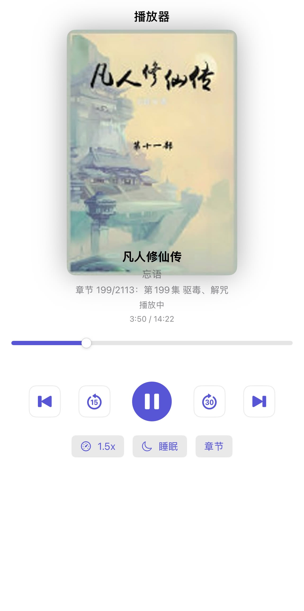
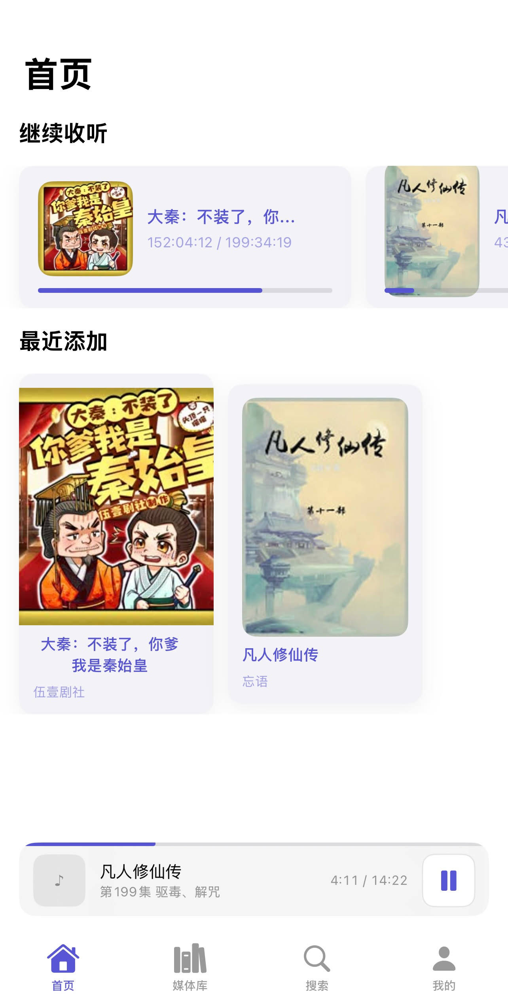
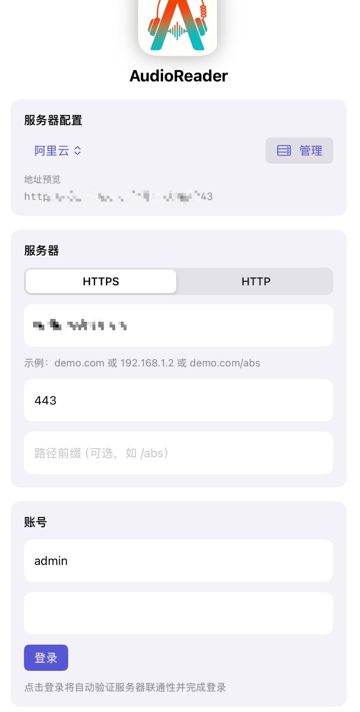
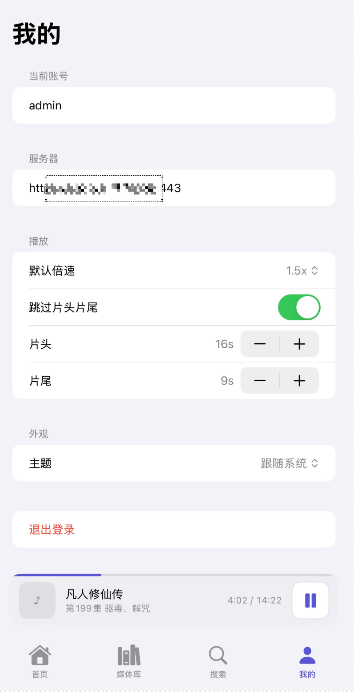

# 🎧 AudioBookshelf iOS 客户端

> 一个由 AI 生成的 Audiobookshelf iOS 客户端，具备增强功能

---

## 📖 概述

这是一个 **AI 生成的 Audiobookshelf iOS 客户端**，功能精简，并增加了**跳过片头片尾**的功能，为您提供更好的收听体验。

### ✨ 主要功能

- 🎯 **智能播放**：自动跳过片头和片尾片段
- 📚 **图书馆集成**：无缝连接到您的 Audiobookshelf 服务器
- 🎨 **现代界面**：简洁直观的界面设计
- 🔐 **轻松认证**：简单的服务器登录和配置

---

## 📱 截图展示

### 播放器与图书馆

<table>
  <tr>
    <td align="center">
      
       <i>🎵 播放器界面</i>
    </td>
    <td align="center">
      
       <i>📚 图书馆主页</i>
    </td>
  </tr>
</table>

### 认证与设置

<table>
  <tr>
    <td align="center">
      
       <i>🔐 登录界面</i>
    </td>
    <td align="center">
      
       <i>⚙️ 配置设置</i>
    </td>
  </tr>
</table>

---

## 🚀 快速开始

### 前置要求

- iOS 设备或模拟器
- Xcode（建议使用最新版本）
- Audiobookshelf 服务器实例

### 安装步骤

1. 克隆此仓库
2. 在 Xcode 中打开 `AudioReader/AudioReader.xcodeproj`
3. 在您的 iOS 设备上构建并运行

---

## 🛠 技术栈

- **SwiftUI** - 现代化的声明式 UI 框架
- **AVFoundation** - 音频播放和控制
- **URLSession** - 网络通信

---

## 📄 许可证

本项目采用 MIT 许可证 - 详见 [LICENSE](LICENSE) 文件。

---

## 🙏 致谢

- 由 AI 协助生成
- 为 Audiobookshelf 社区而建

---

  为有声书爱好者打造 ❤️

